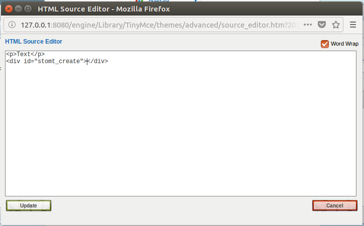

# stomt-Shopware-extension
STOMT Shopware Integration https://www.stomt.com


## Installation


    https://github.com/stomt/stomt-Shopware-extension/archive/StomtFeedback.zip

- Download the ziped folder "StomtFeedback.zip".
- Go In your administration backend to the the Plugin manager into, and upload the ziped folder.
- go to the configuration section of your plugin where you can insert your app-id (that you can find in your app-id [https://stomt.com/](https://stomt.com/ "apps")) .
- Finally activate the plugin and customize it to your needs .


or 
   

    cd custom/plugin
    git clone git@github.com:stomt/stomt-Shopware-extension.git StomtFeedback

then open the Plugin manager, install it and activate it 


### Configuration

The parameters can be configured in the admin-panel to initialize the widget.

| Property | Type | Description |
| :--- | :--- | :--- |
| `appId` _(required)_ | String | The `appId` is your pages application id. You can find it in your application overview in STOMT (https://www.stomt.com/YOUR_PAGE/apps). The target connected to this application id will be used as target. |
| `position` | String | You can set the `position` of the button, the default position is `right`. If required you can align the button to the left side by passing `position: 'left'`. |
| `label` | String | The default label of the button is `Feedback`, you can change that by passing another `label`. |
| `colorText` | String | To change the colors used for the widget button you have three options to configure. The first one is `colorText`, it allows you to change the text color (default: `#FFFFFF`). |
| `colorBackground` | String | The `colorBackground` option allows you to change the background color of the button (default: `#0091C9`). |
| `colorHover` | String | The `colorHover` option allows you to change the background color of the button when the user hovers it (default: `#04729E`). |
| `preload` | Boolean | By setting the property `preload` to `true`, you can tell the Widget to preload the Tab iframe in the background (default: `false`). This reduces the loading delay when showing the Tab for the first time. |


## Example UI

### Admin-panel / User interface:


## Documentation Feed
### Create feed:


```html
<div id="stomt_create"></div>
```
1- go to Content>shop pages

2-select a page to edit

3-add the html code and save


### integrate feed:

```html
<div id="stomt_feed"></div>
```


1- go to Content>shop pages

2-select a page to edit

3-add the html code and save

## Frequently Asked Questions

### What is STOMT all about?

STOMT lets you instantly give feedback in a predefined format. Head off to https://www.stomt.com to find out more!


## Authors

[Mariem Bader](https://github.com/mariembader123) | [Follow Mariem Bader on STOMT](https://www.stomt.com/mariem-bader)

[Max Klenk](https://github.com/maxklenk) | [Follow Max Klenk on STOMT](https://www.stomt.com/max-klenk)

See also the list of [contributors](https://github.com/stomt/stomt-joomla-extension/contributors) who participated in this project.

## License

The MIT License (MIT). Please see [License File](LICENSE) for more information.

## More about STOMT

*Integrate and use STOMT on all your touchpoints.*

* On the web [www.stomt.com](https://www.stomt.com)
* [STOMT for iOS](http://stomt.co/ios)
* [STOMT for Android](http://stomt.co/android)
* [STOMT for Unity](http://stomt.co/unity)
* [STOMT for Unreal](http://stomt.co/unreal)
* [STOMT for Websites](http://stomt.co/web)
* [STOMT for Wordpress](http://stomt.co/wordpress)
* [STOMT for Drupal](http://stomt.co/drupal)

